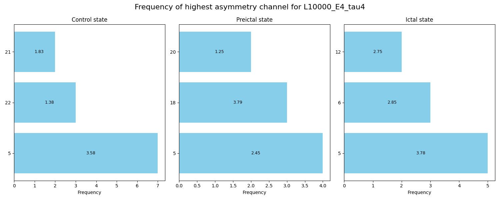

# Epilepsy Seizure Detection using Causal Asymmetries in Deep Learning Models
Code developed by Tenzin Sangpo Choedon, Summer 2025

## 📄 Abstract
Extension on [the thesis study](https://github.com/sappoPrivy/Causal_asymmetries_in_epilepsy_using_CCM)

## 🗂️ Table of Contents

- [Abstract](#-abstract)
- [Project Structure](#-project-structure)
- [Prerequisites](#-prerequisites)
- [Usage](#-usage)
- [Key Findings](#-key-findings)

## 🏗️ Project Structure

root/  
├── src/  
│   ├── preprocess_data.py  
│   ├── process_CCM_subjects.py  
│   └── eval_CCM_subjects.py  
├── docs/  
│   └── Rapport.pdf  
├── data/    
├── README.md  
└── .gitignore  

## ✅ Prerequisites

**Python 3.7+**  
- Required Python packages (install via pip):  
  ```bash
  pip install numpy scipy pandas matplotlib
  ```
**CCM**  
- Download Python juypiter version from [here](https://phdinds-aim.github.io/time_series_handbook/06_ConvergentCrossMappingandSugiharaCausality/ccm_sugihara.html#introduction)

**CHB-MIT**
- Download dataset from [here](https://physionet.org/content/chbmit/1.0.0/#files-panel) and store it in root/data folder 

**pyEDM**
- Download pyEDM (install via pip):
  ```bash
  pip install pyEDM
  ```

## 🚀 Usage

Run the scripts in this order:

1. **Preprocess data**  
   ```bash
   python src/preprocess_data.py
   ```
2. **Compute CCM on subjects**  
   ```bash
   python src/process_CCM_subjects.py
   ```
3. **Evaluate CCM results of all subjects**  
   ```bash
   python src/eval_CCM_subjects.py
   ```

## 📘 Key Findings
[Read the Rapport](docs/Rapport.pdf)

<!--
<p align="center">
  
</p>

<p align="center">
  
</p>
-->
