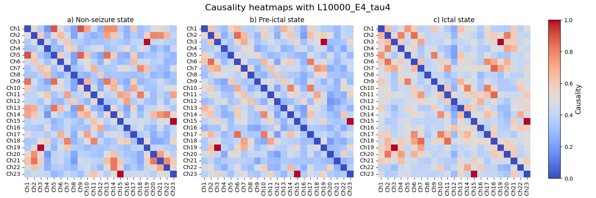
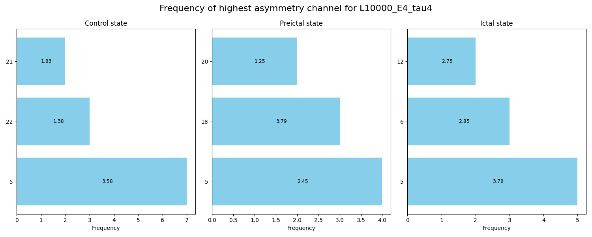

# Methods

## Dataset
- CHB-MIT dataset
- Selected subjects: 1, 2, 3,4, 5, 6, 8, 9, 10, 12, 13, 14, 15, 16, 17, 20, 21, 23 due to missing data.
- 23 EEG channels
## CCM Data

## Graph Classification Problem
- This is achieved using a GNN model, thus this becomes a graph classification problem.
- The graph (G) is composed of nodes that represent EEG channels, set of edges that represent causal relationships between EEG channels and edge weights that represent the causality (CCM) scores of the relationship.
- The goal is to learn the function: f(G) -> y, where it predicts a class label given an input graph G.
- The class labels 0, 1, 2 corresponds to non-seizure, pre-seizure and seizure state.

## Multi-class GNN classification
- the causality scores were normalized
- Transformer GNN was implemented
- hyperparamter tuning was performed for learning rate, weight decay, number of GCN layers, hidden layer size, dropout and batch size using Bayesian Optimization
- Additionally, node features were included - 38 aperiodic slope values per node, and these were also normalized.
- Although several methods has been utilized, it did not improve the performance of the models. These results could be due to the limited dataset leading to the model underfitting or due to lack of meaningful data.

 **This is still a work in progress and may have potential updates**.
## Binary GNN classification
- Classes changed: 0, 1 correspond to non-seizure and seizure state.
- Ensure overlapping sliding window to maximise sample size of CCM matrices
